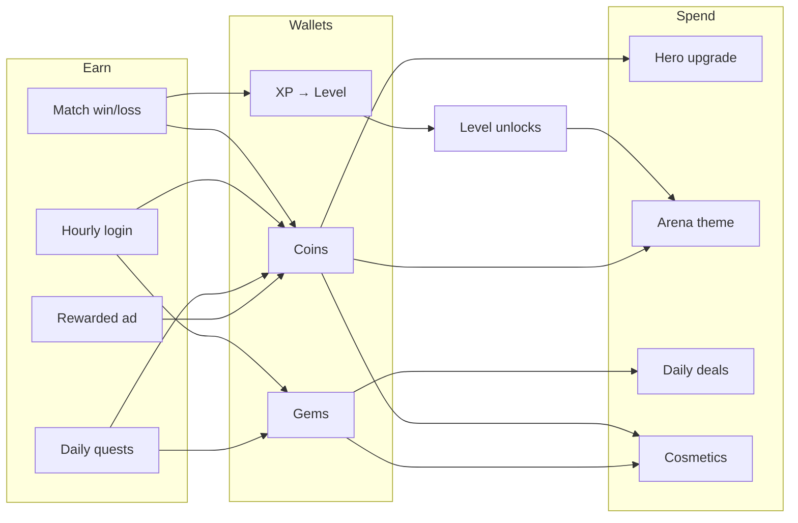

# Feature Spec — Coins, Gems & Level (Cricket League–inspired)

> **Status:** Documentation only — **no code changes yet.**  
> Defines how Stick Archer should implement the progression economy inspired by
> Miniclip *Cricket League*, adapted for a 1v1 archery duel.
>
> **Last updated:** 2026-06-08  
> **Related:** [CRICKET_LEAGUE_REFERENCE.md](CRICKET_LEAGUE_REFERENCE.md) · [Progression README](../Assets/Scripts/Progression/README.md) · [PROJECT_DOCUMENTATION.md](PROJECT_DOCUMENTATION.md)

---

## 1. Goals

| Goal | Why |
|------|-----|
| **Coins** | Primary soft currency — reward every match, fund upgrades & common unlocks |
| **Gems** | Premium hard currency — daily deals, rare unlocks, speed-ups (Cricket League pattern) |
| **Level** | Account progression gate — unlock tours, characters, features; visible skill journey |

Together they form the **retention loop**:

```
Play match → earn coins + XP → level up → unlock content → spend coins/gems → play again
```

Cricket League uses the same trio; Stick Archer should match the **economic rhythm** without copying cricket-specific sinks (bats, balls, card packs) verbatim.

### 1.1 Source of truth and status rules

This document is the **product/design source of truth** for the economy. The current
implementation source of truth remains:

| Area | Current code source |
|------|---------------------|
| Profile fields | `Assets/Scripts/Progression/PlayerProfile.cs` |
| Coin and XP grants | `Assets/Scripts/Progression/ProfileManager.cs` |
| Tunable defaults | `Assets/Scripts/Analytics/RemoteConfig.cs` |
| Menu badge UI | `Assets/Scripts/UI/ProfileBadge.cs` |

Status labels in this file mean:

| Label | Meaning |
|-------|---------|
| ✅ | Implemented and wired in code today |
| 🟡 | Designed / partially implemented, but not complete in player flow |
| ⬜ | Product spec only; not implemented yet |
| TBD | Needs a product decision before coding |

---

## 2. Current state vs target

| Feature | Implemented today | Target (this spec) |
|---------|-------------------|-------------------|
| **Coins** | ✅ Earn on match end, spend API, main-menu badge | + hourly/daily earn, shop sinks, rewarded-ad bonus, result UI |
| **Gems** | ⬜ Not in `PlayerProfile` | New field, earn + spend rules, gem icon UI |
| **Level** | ✅ XP curve, level-up events, badge shows `LV N` | + unlock table (arenas, chars), level-up celebration UI, tour gating |
| **Level bounds** | ✅ Starts at level 1; no hard max cap in code | Explicit launch cap decision before shipping |
| **Feature stories** | 🟡 Covered across docs; not all acceptance criteria were explicit | Central story matrix in §14 |

### Existing code touchpoints (reference only)

| Piece | Location |
|-------|----------|
| Profile data | `PlayerProfile.cs` — `coins`, `level`, `xp` |
| Economy API | `ProfileManager.cs` — `AddCoins`, `TrySpendCoins`, `AddXp`, `GrantMatchRewards` |
| Tunables | `RemoteConfig.cs` — `coins_per_match`, `coins_per_win`, `xp_per_match`, `xp_per_win` |
| Main menu UI | `ProfileBadge.cs` — level, XP bar, coins |
| Result rewards | `UIManager.BuildRewardsCard` — built but hidden on victory (Fix 03) |

### 2.1 Documentation coverage snapshot

| Topic user/product expects | Documented? | Notes |
|----------------------------|-------------|-------|
| How coins are gained | ✅ | §3.2 covers match, ads, login, quests, level-up, account-link sources |
| How coins are spent | ✅ | §3.3 covers hero unlocks/upgrades, arena themes, cosmetics, daily deals |
| How gems are gained | ✅ | §4.3 covers starter pack, login, milestones, quests, achievements, IAP, ads |
| How gems are spent | ✅ | §4.4 covers daily deals, timed packs, premium themes, cosmetics |
| XP and level progression | ✅ | §5.2-§5.4 cover XP sources and formula |
| Minimum account level | ✅ | §5.3 states level starts at 1 |
| Maximum account level | ✅ | §5.3 states current code has no hard max; launch cap is a product decision |
| Level unlocks / gates | ✅ | §5.5 defines the current proposed unlock table |
| UI placement | ✅ | §3.4, §4.5, §5.7 and design specs cover menu/results/modals |
| Analytics and RemoteConfig | ✅ | §8-§9 list existing and planned keys/events |
| Persistence / migration | ✅ | §7 documents schema additions and migration choice |
| Player-facing stories | ✅ | §14 lists stories and acceptance criteria |

---

## 3. Coins (soft currency)

### 3.1 Fantasy name & icon

- **Display name:** Coins (keep simple; no rename needed)
- **Icon:** `Resources/UI/Icons/coin.png` ✅ exists
- **Color token:** Gold `#FFD933` (`UIDesignSystem.Gold`)

### 3.2 How players earn coins

| Source | Cricket League | Stick Archer (proposed) | Amount (default) | RemoteConfig key |
|--------|----------------|-------------------------|------------------|------------------|
| Match played | ✅ | ✅ (exists) | 10 | `coins_per_match` |
| Match won | ✅ | ✅ (exists) | +25 | `coins_per_win` |
| Rewarded ad (optional) | ✅ double rewards | Post-match "Watch ad → 2× coins" | +same as match | `rewarded_coins` (exists) |
| Hourly login | 100 / hour | Free chest every 60 min | 100 | `coins_hourly_login` *(new)* |
| 12-hour login | 600 + pack | Mega chest (optional ad) | 600 | `coins_12h_login` *(new)* |
| Daily quest | ✅ | "Win 2 matches" etc. | 50–200 | per-quest keys *(new)* |
| Level-up bonus | partial | One-time burst on level up | 50 × level | `coins_per_level_up` *(new)* |
| Account link | — | First cloud link bonus | 200 | `coins_link_bonus` *(new)* |

**Rules:**
- All coin grants go through `ProfileManager.AddCoins(amount, reason)` (when implemented).
- `reason` string required for analytics (`match_win`, `hourly_login`, `quest_daily_win2`, etc.).
- No negative coin balance.

### 3.3 How players spend coins

| Sink | Cricket League parallel | Stick Archer (proposed) | Example cost |
|------|-------------------------|-------------------------|--------------|
| Character unlock | Buy player card | Unlock archer hero | 500–2,000 |
| Character upgrade | Level up card | Raise hero star level (+1) | 100 × current star |
| Arena tour unlock | Unlock stadium | Unlock arena biome theme | 1,000 at level gate |
| Cosmetic | Bat skin | Bow / arrow skin (cosmetic) | 300–800 |
| Match entry fee | Some tours | **Optional — defer** | 50 per ranked match |
| Shop daily deal | Coin-priced items | Rotating coin offers | varies |

**Rules:**
- Spend via `ProfileManager.TrySpendCoins(amount, reason)` — returns `false` if insufficient.
- UI must show cost and balance before confirm.
- Refunds: none (unless support/manual).

### 3.4 Coin UI placement

| Screen | Element | Notes |
|--------|---------|-------|
| **Main Menu** | Profile badge — coin count + icon | ✅ exists; keep top-right of badge |
| **Game HUD** | Optional compact coin (hide during match) | Defer — clutter risk |
| **Result screen** | `+35 coins` with count-up animation | Use `BuildRewardsCard` or slim banner below score |
| **Shop** | Large balance header | Future screen |
| **Level-up modal** | "+150 coins" if level bonus granted | Future overlay |

**Format:** `{amount:N0}` with coin icon left (e.g. `🪙 1,240` → use `IconCoin` sprite).

---

## 4. Gems (hard currency)

### 4.1 Fantasy name & icon

- **Display name:** Gems
- **Icon:** **Needs art** — add `Resources/UI/Icons/gem.png` (design: diamond/crystal, blue-purple `#6B8CFF` to distinguish from gold coins)
- **Color token:** suggest `Gem = #6B8CFF` — add to `UIDesignSystem` when implementing

### 4.2 Design role (Cricket League model)

Gems are **scarcer** than coins and gate **premium** actions:

| Use gems for | Use coins for |
|--------------|---------------|
| Daily deal purchases | Common upgrades |
| Rare character unlock | Standard hero unlock |
| Skip timers on packs | Grindable cosmetics |
| Premium shop bundles (IAP also sells gems) | Match earnings |

**F2P principle:** Every gem sink must have a **coin or time alternative** where possible, so non-payers aren't blocked from core gameplay.

### 4.3 How players earn gems

| Source | Cricket League | Stick Archer (proposed) | Default amount | RemoteConfig key |
|--------|----------------|-------------------------|----------------|------------------|
| New account | ~gems starter | FTUE welcome gift | 10 | `gems_starter_pack` *(new)* |
| 12-hour login | 5 gems | Mega chest | 5 | `gems_12h_login` *(new)* |
| Level milestone | occasional | Every 5 levels | 5 | `gems_every_n_levels` *(new)* |
| Quest weekly | ✅ | "Win 10 matches" | 10 | quest-specific |
| Achievement | ✅ | First headshot, first online win | 1–5 | achievement keys |
| IAP purchase | ✅ | Bunch/Bag/Pile of Gems | store-defined | — |
| Account link | 100 gems | Link Facebook/Apple/Google | 100 | `gems_link_bonus` *(new)* |
| Rewarded ad | rare | Optional "watch for 2 gems" | 2 | `gems_rewarded_ad` *(new)* |

**Rules:**
- New API (when coded): `ProfileManager.AddGems`, `TrySpendGems` — mirror coin methods.
- Persist `PlayerProfile.gems` (int, default 0).
- Analytics: `currency_earned` / `currency_spent` with `currency_type=gem`.
- User property: `gems` for segmentation.

### 4.4 How players spend gems

| Sink | Example cost |
|------|--------------|
| Daily deal — rare hero shard | 50 gems |
| Instant open timed pack | 10 gems |
| Premium arena theme | 100 gems |
| Rename / flair (cosmetic) | 20 gems |
| Elite Pass purchase | IAP only (gems not accepted) |

### 4.5 Gem UI placement

| Screen | Element |
|--------|---------|
| **Main Menu** | Second currency chip next to coins in ProfileBadge *(extend badge width or stack)* |
| **Shop** | Gem balance + "Get Gems" IAP button |
| **Daily Deals row** | Price in gems with gem icon |
| **Result screen** | Only if gems earned this session (rare) |

**Layout suggestion (ProfileBadge):**

```
┌─────────────────────────────────────────────┐
│ LV 12    ████████░░░░ XP                    │
│          🪙 1,240          💎 18            │
└─────────────────────────────────────────────┘
```

---

## 5. Level (account progression)

### 5.1 What level represents

**Account level** (not per-character level — that is a separate future system):

- Reflects total XP from playing matches.
- Gates **content unlocks** (Cricket League: tours; Stick Archer: arena biomes, game modes, shop tiers).
- Shown everywhere as `LV {n}` or `Level {n}`.

Per-character **hero level / star rank** is a **coin sink** (§3.3), not the same as account level.

### 5.2 XP sources

| Source | Stick Archer (proposed) | Default XP | RemoteConfig key |
|--------|-------------------------|------------|------------------|
| Match played | ✅ exists | 20 | `xp_per_match` |
| Match won | ✅ exists | +50 | `xp_per_win` |
| First win of day | — | +30 bonus | `xp_first_win_daily` *(new)* |
| Quest completion | — | 50–150 | quest keys |
| Headshot in match | — | +5 per headshot (cap 15/match) | `xp_per_headshot` *(new)* |

### 5.3 Level bounds (minimum / maximum)

| Rule | Current implementation | Product rule for this spec |
|------|------------------------|----------------------------|
| Minimum account level | `PlayerProfile.level = 1` by default | New and migrated profiles must never display below **Level 1** |
| Maximum account level | **No hard max cap** in code; `AddXp` keeps advancing while XP covers the next threshold | Do not show a "MAX" state until a product cap is approved and implemented |
| Current planned unlock range | Unlock table currently defined through Level 20 | Expand to Level 50 before a launch that needs long-term account goals |
| XP at max level | Not applicable today because there is no max | TBD if `max_account_level` is introduced |

**Engineering note:** if a hard cap is added later, gate it through RemoteConfig
(`max_account_level`) and define whether overflow XP is discarded, banked, or converted
to coins. Until then, the account level is intentionally uncapped.

### 5.4 Leveling curve (keep existing unless balance changes)

```
XP to advance from level L → L+1:
  XpToAdvance(L) = 100 + (L - 1) × 50

Examples:
  Level 1 → 2:  100 XP
  Level 2 → 3:  150 XP
  Level 5 → 6:  300 XP
  Level 10 → 11: 550 XP
```

**Multi-level-up:** If a single grant exceeds multiple thresholds, roll over in one frame (already implemented in `AddXp`).

**RemoteConfig override (future):** Optional keys `xp_curve_base`, `xp_curve_step` if live ops needs tuning.

### 5.5 Level unlock table (proposed)

Cricket League unlocks **tours** by level. Stick Archer unlocks **arena biomes** and **features**:

| Level | Unlock |
|-------|--------|
| 1 | Forest arena (default), Adventurer hero, Practice + Online |
| 3 | Castle arena theme |
| 5 | Soldier hero unlock available (coins or 500) |
| 8 | Desert arena theme |
| 10 | Ranked leagues tab |
| 12 | Daily quests |
| 15 | Snow arena theme |
| 20 | Third hero slot in roster preview |

*Adjust numbers after playtesting — document in RemoteConfig as JSON blob `level_unlocks` for server tuning.*

### 5.6 Level-up moment (UX spec)

When `Profile.level` increases:

1. **Analytics:** `level_up` event with `{ level: N }` ✅ exists
2. **SFX:** ascending arpeggio ✅ `AudioManager` has match win stinger — reuse or extend
3. **UI overlay (new):**
   - Full-screen dim + card: "LEVEL UP!"
   - New level number (large gold text)
   - Unlocks list ("Castle Arena unlocked!")
   - Coin bonus if applicable (`+{50 × level} coins`)
   - Tap to dismiss
4. **ProfileBadge** refreshes via `OnLevelUp` ✅ event exists
5. **Main menu** — optional glow on newly unlocked tour/hero

### 5.7 Level UI placement

| Screen | Element | Status |
|--------|---------|--------|
| Main Menu | `LV {n}` + XP fill bar | ✅ ProfileBadge |
| Result screen | XP gained + bar fill animation + "LEVEL UP!" | 🟡 card exists, not on victory |
| Character select | "Requires LV 5" lock overlay | ⬜ |
| Shop | "Your level: 12" for deal eligibility | ⬜ |
| Post-level-up | Modal (§5.6) | ⬜ |

---

## 6. Economy loop (mermaid)



---

## 7. Data model changes (planned — not coded)

When implementation starts, extend `PlayerProfile`:

```csharp
// Planned fields (schemaVersion bump → 2)
public int gems = 0;

// Planned timestamps (Unix seconds) for login rewards
public long lastHourlyClaimUtc = 0;
public long last12hClaimUtc = 0;
public long lastDailyQuestResetUtc = 0;
```

Migration rule: on load, if `schemaVersion < 2`, set `gems = RemoteConfig gems_starter_pack` for existing players once (or 0 — product decision).

---

## 8. RemoteConfig keys (planned)

Add to `RemoteConfig.cs` defaults when implementing:

| Key | Default | Purpose |
|-----|---------|---------|
| `coins_per_match` | 10 | ✅ exists |
| `coins_per_win` | 25 | ✅ exists |
| `xp_per_match` | 20 | ✅ exists |
| `xp_per_win` | 50 | ✅ exists |
| `rewarded_coins` | 50 | ✅ exists |
| `coins_hourly_login` | 100 | Hourly chest |
| `coins_12h_login` | 600 | 12h chest |
| `gems_12h_login` | 5 | 12h chest |
| `gems_starter_pack` | 10 | New player |
| `gems_link_bonus` | 100 | Account link |
| `coins_per_level_up` | 50 | × level on level-up |
| `gems_every_n_levels` | 5 | Grant every 5 levels |
| `xp_first_win_daily` | 30 | Daily first-win bonus |
| `xp_per_headshot` | 5 | Per headshot XP |
| `level_unlocks` | JSON | Level-gated arena/feature/hero unlock table |
| `max_account_level` | unset | Optional future hard cap; unset means uncapped |

---

## 9. Analytics events (planned extensions)

Existing events to reuse:

| Event | When |
|-------|------|
| `currency_earned` | Any coin/gem grant — add param `currency_type`: `coin` \| `gem` |
| `currency_spent` | Any purchase |
| `level_up` | Level increases |

New events (when features ship):

| Event | Params |
|-------|--------|
| `login_reward_claimed` | `type`: hourly \| 12h, `coins`, `gems` |
| `daily_quest_completed` | `quest_id`, `coins`, `gems`, `xp` |
| `unlock_gated` | `feature`, `required_level`, `player_level` |
| `rewarded_ad_watched` | `placement`, `coins`, `gems` |

User properties (segmentation):

| Property | Values |
|----------|--------|
| `level` | int ✅ |
| `coins` | int ✅ |
| `gems` | int *(new)* |
| `payer` | free \| ad_watcher \| iap *(future)* |

---

## 10. Cricket League → Stick Archer mapping

| Cricket League | Stick Archer (this spec) |
|----------------|--------------------------|
| Coins from matches | Same — `GrantMatchRewards` |
| Gems from login / IAP | Gems field + login chests |
| Account level | Same XP/level system |
| Level unlocks tours | Level unlocks arena biomes + features |
| Upgrade player card (coins) | Upgrade hero star (coins) |
| Daily deals (gems) | Shop daily row (gems) |
| Profile header balances | Extended ProfileBadge |
| Post-match coin display | Result rewards card |

---

## 11. Design deliverables (before coding)

| Asset / screen | Path | Status |
|----------------|------|--------|
| Coin icon | `designs/icons/coin.svg` → `Resources/UI/Icons/coin.png` | ✅ |
| Gem icon | `designs/icons/gem.svg` → `Resources/UI/Icons/gem.png` | ✅ SVG · ⬜ PNG export |
| Main menu badge (coins+gems) | `designs/01_main_menu.svg` | ✅ updated |
| Result rewards strip | `designs/08_results_victory.svg`, `09_results_defeat.svg` | ✅ updated |
| Level-up modal | `designs/11_level_up.svg` + `specs/11_level_up.md` | ✅ new |
| Login rewards modal | `designs/12_login_rewards.svg` + `specs/12_login_rewards.md` | ✅ new |
| Character lock overlay | `designs/02_character_select.svg` | ✅ updated |
| Economy index spec | `designs/specs/11_progression_economy.md` | ✅ updated |

---

## 12. Implementation phases (when ready to code)

**Do not start until designs for §11 are approved.**

| Phase | Scope | Depends on |
|-------|-------|------------|
| **E1** | Gem field + AddGems/TrySpendGems + ProfileBadge shows gems | Gem icon art |
| **E2** | Result screen coin/XP strip (defeat + optional victory footer) | Design sign-off |
| **E3** | Level-up modal + coin bonus on level | E1 optional |
| **E4** | Hourly / 12h login rewards | E1, chest UI design |
| **E5** | Level unlock table + gated content | Arena/hero content |
| **E6** | Daily quests | Quest UI design |
| **E7** | Shop daily deals (gem prices) | Shop screen (P3/P4) |

---

## 13. Open product decisions (resolve before E1)

| # | Question | Options |
|---|----------|---------|
| 1 | Show rewards on victory screen? | Slim footer only (keep clean score card) vs separate "Rewards" tap |
| 2 | Starter gems for existing saves on migration? | 0 vs 10 vs one-time grant |
| 3 | Match entry fee in coins? | Yes for ranked only / No |
| 4 | Per-character level vs account level only? | Account only first; hero stars later |
| 5 | Gem pay-to-win bounds | Cosmetics only vs minor stat boosts |
| 6 | Launch max account level? | Keep uncapped / cap at 50 with overflow rule |

---

## 14. Feature stories and acceptance criteria

Use this as the player-story checklist before marking the economy/progression feature
set "properly documented" or ready to implement.

| Story ID | Player story | Status | Acceptance criteria |
|----------|--------------|--------|---------------------|
| ECO-01 | As a player, I earn coins and XP when I finish a match. | ✅ | Loss grants `coins_per_match` + `xp_per_match`; win adds `coins_per_win` + `xp_per_win`; rewards persist. |
| ECO-02 | As a player, I can spend coins only when I can afford the purchase. | ✅ API / ⬜ shop UI | `TrySpendCoins` returns false with no balance change when unaffordable; successful spend logs analytics and saves. |
| ECO-03 | As a player, I have a gems wallet for premium rewards. | ⬜ | `PlayerProfile.gems`, `AddGems`, `TrySpendGems`, profile UI, persistence, and analytics all exist. |
| ECO-04 | As a player, I know every way coins can be earned. | ✅ spec / 🟡 code | Match rewards are coded; login, quest, level-up, account-link, and ad coin sources are specified before implementation. |
| ECO-05 | As a player, I know every way gems can be earned. | ✅ spec / ⬜ code | Starter, 12-hour chest, level milestone, quest, achievement, IAP, account-link, and rewarded-ad gem sources are specified. |
| ECO-06 | As a player, my account level always starts at a valid value and progresses predictably. | ✅ | Minimum level is 1; XP curve is `100 + (level - 1) * 50`; multi-level-up rollover works. |
| ECO-07 | As a player, I understand the max-level rule. | ✅ spec / ✅ code | Current code has no hard max; docs state no "MAX" UI until `max_account_level` is approved and implemented. |
| ECO-08 | As a player, new content unlocks when I reach required levels. | ⬜ | Unlock table exists in config/data, UI shows requirements, and gates check `profile.level`. |
| ECO-09 | As a player, I see a satisfying level-up moment. | ⬜ | `OnLevelUp` opens modal, shows new level, unlocks, coin bonus, and blocks input until dismissed. |
| ECO-10 | As a player, I see rewards clearly after a match. | 🟡 | Result screen shows coins, XP, level-up flag, and updated balances without overlapping score/buttons. |
| ECO-11 | As a returning player, I can claim timed login rewards. | ⬜ | Hourly and 12-hour timers persist; ready/locked states display; claims grant configured coins/gems once. |
| ECO-12 | As a player, I can complete quests/achievements for extra rewards. | ⬜ | Quest IDs, reset cadence, reward amounts, claim states, and analytics are defined. |
| ECO-13 | As a player, I can use gems/coins in shops and daily deals. | ⬜ | Shop shows balance, cost, affordability state, confirmation, success, and insufficient-currency error. |
| ECO-14 | As a live-ops/product owner, I can tune economy values without rebuilding. | 🟡 | Existing match keys are in RemoteConfig; planned keys are added before the related feature reads them. |
| ECO-15 | As an engineer/designer, I can verify save migration safely. | 🟡 | Schema v1 local saves load; schema v2 migration decision for starter gems is resolved before gems ship. |

---

## 15. Verification checklist (after implementation)

- [ ] New profile starts with `coins=0`, `gems=10`, `level=1`, `xp=0`
- [ ] Win practice match → coins and XP increase; badge updates live
- [ ] Level-up triggers modal + `level_up` analytics event
- [ ] Insufficient coins/gems → spend returns false, UI shows error
- [ ] Hourly claim unavailable until 60 min elapsed
- [ ] Relaunch app → balances persist in `profile.json`
- [ ] RemoteConfig change to `coins_per_win` reflects on next match without rebuild

---

## 16. References

- [CRICKET_LEAGUE_REFERENCE.md](CRICKET_LEAGUE_REFERENCE.md) — full Cricket League feature study
- [Assets/Scripts/Progression/README.md](../Assets/Scripts/Progression/README.md) — current code architecture
- [GAMEPLAY_SYSTEMS.md §11](GAMEPLAY_SYSTEMS.md#11-progression-post-match) — post-match rewards today
- [designs/specs/01_main_menu.md](../designs/specs/01_main_menu.md) — ProfileBadge layout
